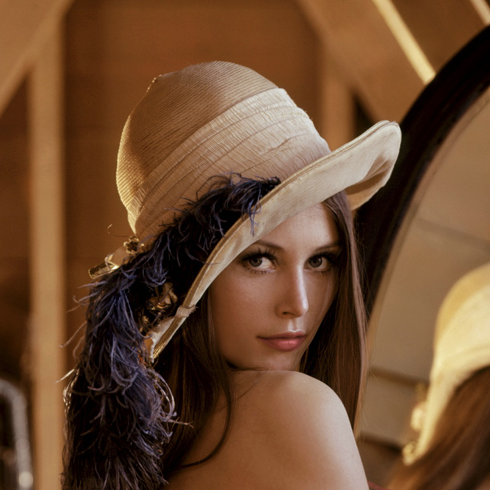

# cv_finalproject
computer vision final project(2018)

simple nature makeup implement

# example

# why add functions in makeup.py have two program block?
the former is done by matrix manipulation,
the latter is down by pixel manipulation.